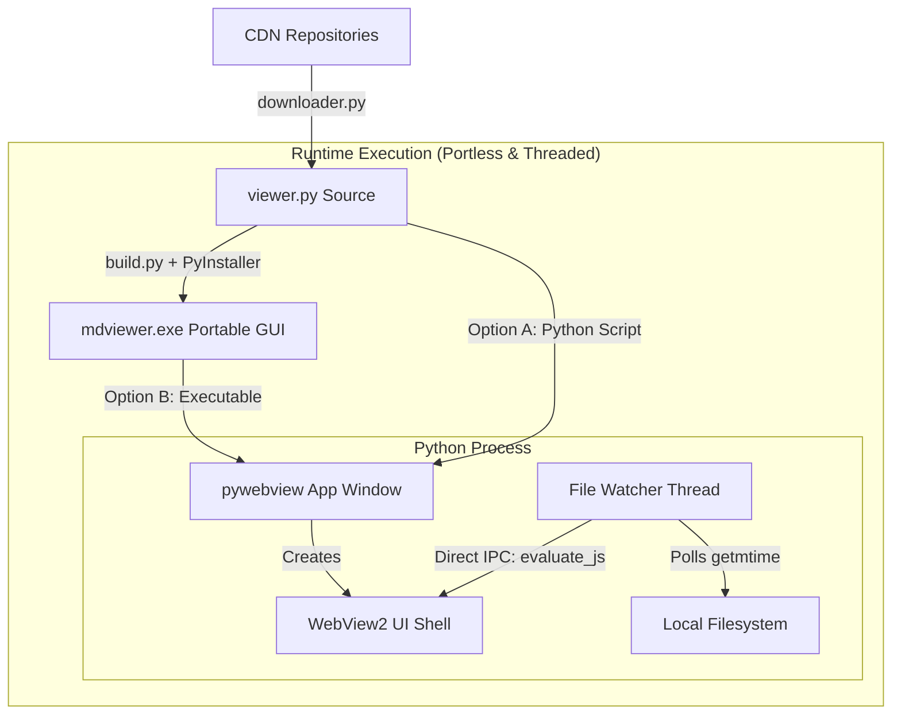

# PMDV (Portable Markdown Viewer)

PMDV (Portable Markdown Viewer) is a self-contained, offline-compatible, and portless Markdown viewer desktop application. It features a native desktop GUI shell with dynamic parser engine hot-swapping, evolutionary math rendering, and direct file modification watching.

---

## 1. Scientific Domain & Technical Overview

### A. Markdown Abstract Syntax Tree (AST) Formulations
Markdown parsing is modeled as a deterministic sequence transformation translating a raw character stream into a structured Abstract Syntax Tree (AST), which is subsequently compiled into Document Object Model (DOM) nodes:

$$\text{Raw Text Stream} \xrightarrow{\text{Lexical Analysis (Tokenization)}} \mathbf{T} \xrightarrow{\text{Syntactic Analysis (AST Parsing)}} \mathcal{A} \xrightarrow{\text{Compilation}} \text{HTML String}$$

Where the AST $\mathcal{A}$ is a tree hierarchy of nodes:

$$\mathcal{A} = (N, E), \quad N = \{n_{\text{root}}, n_{\text{header}}, n_{\text{paragraph}}, n_{\text{code}}, \dots\}$$

PMDV hosts multiple parsing engines, allowing runtime functional mapping hot-swapping to guarantee render rendering parity across dialects:

$$\text{Viewport}(\mathbf{x}) = f_{\text{engine}}(\mathbf{x}), \quad \text{engine} \in \{\text{Marked.js}, \text{Markdown-it}\}$$

### B. WebView2 Sandboxing & LocalStorage Virtualization
Operating within an `about:blank` local sandbox context triggers strict security constraints. Under Chromium and Edge WebView2 security policies, writing or reading from browser-persistent storage throws a blocking `SecurityError`:

$$\text{Access}(\text{localStorage}) \rightarrow \text{SecurityError} \quad \text{if } \text{Origin} = \text{about:blank}$$

To prevent main-thread execution crashes, PMDV virtualizes the Web Storage API by wrapping accesses using a dynamic in-memory fallback block:

$$\mathcal{S}_{\text{virtual}} = \{ \text{getItem}(k) \mapsto \mathbf{M}[k], \quad \text{setItem}(k, v) \mapsto \mathbf{M}[k] \leftarrow \text{str}(v) \}$$

Where $\mathbf{M}$ is a volatile JavaScript Object map bypassing disk persistence entirely.

### C. IPC Bridge & Race Condition Prevention
To prevent script loading racing conditions, PMDV decouples data injection from document instantiation. Staging initial data during DOM parsing when compilation of external scripts (e.g., Prism.js, KaTeX) is incomplete leads to compilation failure:

$$\text{Race Condition: } t_{\text{render}} < t_{\text{script\_compile}} \implies \text{TypeError: } \text{marked is not defined}$$

PMDV orchestrates a thread-synchronized load callback:

$$\text{WindowReady} \xrightarrow{\Delta t \ge 300\text{ms}} \text{IPC EvaluateJS} \xrightarrow{} \text{window.updateFromServer}(\text{Payload})$$

---

## 2. Core Features
- **Serverless & Portless GUI**: Eliminates local TCP port bindings. No port conflicts ($10048$) and no background zombie server processes.
- **100% Offline Compatible**: Bundles layout (`github-markdown-css`), syntax highlight (`prism-js`), and typesetting (`katex`) directly inside a single compiled artifact.
- **Dynamic Watcher Thread**: Utilizes native OS filesystem watches (`os.path.getmtime`) combined with WebView IPC messaging to dynamically refresh views.
- **Open Local File & Drag-and-Drop**: Load any local markdown document dynamically from the sidebar or by dragging a file directly into the application window.
- **Interactive Console Debugging**: Double-click or right-click to inspect components using WebKit/Edge Developer Tools directly (`debug=True`).

---

## 3. Operational Harness

### Option A: Local Run (Python Environment)
1. **Initialize Virtual Environment**:
   ```bash
   python -m venv .venv
   .venv\Scripts\activate      # On Windows
   source .venv/bin/activate    # On Linux
   ```
2. **Install Dependencies**:
   ```bash
   pip install -r requirements.txt
   ```
3. **Execute Viewer**:
   ```bash
   python pmdv/pmdv/viewer.py <path-to-markdown-file>
   ```

#### Shell Alias Auto-Setup (Linux/macOS)
Register `pmdv` as a global command in your terminal session:
```bash
eval $(python3 pmdv/pmdv/viewer.py --init)
```

---

### Option B: Standalone Binary Compilation (Portable Mode)
If Python is not present on target offline host machines, compile to a native executable beforehand:

1. **Assemble Embedded Assets**:
   ```bash
   python downloader.py
   ```
2. **Compile with PyInstaller**:
   ```bash
   python build.py
   ```
3. **Execute Standalone Output**:
   ```bash
   ./dist/mdviewer.exe sample.md   # Windows
   ./dist/mdviewer sample.md       # Linux
   ```

---

## 4. Architecture Map



### Directory Structure
```
.
├── pmdv/                # Core package directory
│   ├── pmdv/
│   │   ├── __init__.py  # Package initializer
│   │   └── viewer.py    # Main GUI Application Source
│   ├── README.md        # Technical User Manual
│   ├── requirements.txt # Runtime dependencies (pywebview)
│   └── setup.py         # Setuptools distribution spec
├── build.py             # Compiler packaging automation script
└── downloader.py        # Assets assembler and bundler script
```
