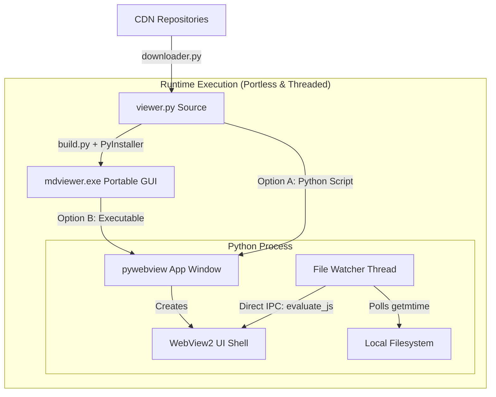
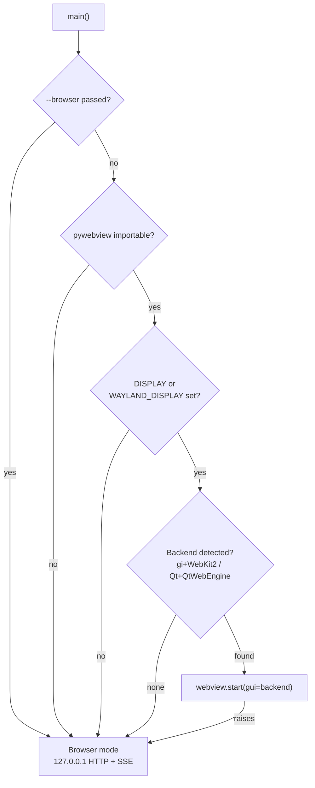

# PMDV (Portable Markdown Viewer)

PMDV (Portable Markdown Viewer) is a self-contained, offline-compatible, and portless Markdown viewer desktop application. It features a native desktop GUI shell with dynamic parser engine hot-swapping, evolutionary math rendering, and direct file modification watching.

---

## 1. Scientific Domain & Technical Overview

### A. Markdown Abstract Syntax Tree (AST) Formulations
Markdown parsing is modeled as a deterministic sequence transformation translating a raw character stream into a structured Abstract Syntax Tree (AST), which is subsequently compiled into Document Object Model (DOM) nodes:

$$\text{Raw Text Stream} \xrightarrow{\text{Lexical Analysis (Tokenization)}} \mathbf{T} \xrightarrow{\text{Syntactic Analysis (AST Parsing)}} \mathcal{A} \xrightarrow{\text{Compilation}} \text{HTML String}$$

Where the AST $\mathcal{A}$ is a tree hierarchy of nodes:

$$\mathcal{A} = (N, E), \quad N = \{n_{\text{root}}, n_{\text{header}}, n_{\text{paragraph}}, n_{\text{code}}, \dots\}$$

PMDV hosts multiple parsing engines, allowing runtime functional mapping hot-swapping to guarantee render rendering parity across dialects:

$$\text{Viewport}(\mathbf{x}) = f_{\text{engine}}(\mathbf{x}), \quad \text{engine} \in \{\text{Marked.js}, \text{Markdown-it}\}$$

### B. WebView2 Sandboxing & LocalStorage Virtualization
Operating within an `about:blank` local sandbox context triggers strict security constraints. Under Chromium and Edge WebView2 security policies, writing or reading from browser-persistent storage throws a blocking `SecurityError`:

$$\text{Access}(\text{localStorage}) \rightarrow \text{SecurityError} \quad \text{if } \text{Origin} = \text{about:blank}$$

To prevent main-thread execution crashes, PMDV virtualizes the Web Storage API by wrapping accesses using a dynamic in-memory fallback block:

$$\mathcal{S}_{\text{virtual}} = \{ \text{getItem}(k) \mapsto \mathbf{M}[k], \quad \text{setItem}(k, v) \mapsto \mathbf{M}[k] \leftarrow \text{str}(v) \}$$

Where $\mathbf{M}$ is a volatile JavaScript Object map bypassing disk persistence entirely.

### C. IPC Bridge & Race Condition Prevention
To prevent script loading racing conditions, PMDV decouples data injection from document instantiation. Staging initial data during DOM parsing when compilation of external scripts (e.g., Prism.js, KaTeX) is incomplete leads to compilation failure:

$$\text{Race Condition: } t_{\text{render}} < t_{\text{script\_compile}} \implies \text{TypeError: } \text{marked is not defined}$$

PMDV orchestrates a thread-synchronized load callback:

$$\text{WindowReady} \xrightarrow{\Delta t \ge 300\text{ms}} \text{IPC EvaluateJS} \xrightarrow{} \text{window.updateFromServer}(\text{Payload})$$

---

## 2. Core Features
- **Serverless & Portless GUI**: Eliminates local TCP port bindings. No port conflicts ($10048$) and no background zombie server processes.
- **100% Offline Compatible**: Bundles layout (`github-markdown-css`), syntax highlight (`prism-js`), and typesetting (`katex`) directly inside a single compiled artifact.
- **Dynamic Watcher Thread**: Utilizes native OS filesystem watches (`os.path.getmtime`) combined with WebView IPC messaging to dynamically refresh views.
- **Open Local File & Drag-and-Drop**: Load any local markdown document dynamically from the sidebar or by dragging a file directly into the application window.
- **Interactive Console Debugging**: Double-click or right-click to inspect components using WebKit/Edge Developer Tools directly (`debug=True`).

---

## 3. Operational Harness

### Option A: Install from PyPI

```bash
pip install pmdv              # browser mode only, zero dependencies
pip install "pmdv[gui]"       # adds pywebview for the native window
pmdv notes.md
pmdv --version
```

The base install pulls **no** dependencies: PMDV renders entirely from bundled
offline assets and serves them over a local loopback port. The `gui` extra adds
`pywebview` for a native window — on Linux that also needs a system webview
runtime, see [5. GUI Troubleshooting Manual (Linux)](#5-gui-troubleshooting-manual-linux).

---

### Option B: Local Run (Python Environment)
1. **Initialize Virtual Environment**:
   ```bash
   python -m venv .venv
   .venv\Scripts\activate      # On Windows
   source .venv/bin/activate    # On Linux
   ```
2. **Install Dependencies**:
   ```bash
   pip install -r requirements.txt
   ```
3. **Execute Viewer**:
   ```bash
   python pmdv/pmdv/viewer.py <path-to-markdown-file>
   ```

#### Rendering Modes (Native WebView vs Browser)

PMDV prefers a native window (pywebview) and falls back to your default browser
whenever no window can be opened — missing backend, headless session, or a
backend that fails at startup. The reason is always printed to stderr with a
`[PMDV]` prefix.

On Linux `pip install pywebview` alone is **not** enough: pywebview only wraps a
native webview runtime, which must come from the system (WebKitGTK via PyGObject,
or QtWebEngine via PyQt/PySide). Force a mode with `--browser` / `--webview`, or
pin a backend with `PMDV_GUI=gtk|qt`.

See [5. GUI Troubleshooting Manual (Linux)](#5-gui-troubleshooting-manual-linux)
for installation commands, symptom-by-symptom fixes, and verification steps.

#### Shell Alias Auto-Setup (Linux/macOS)
Register `pmdv` as a global command in your terminal session:
```bash
eval $(python3 pmdv/pmdv/viewer.py --init)
```

---

### Option C: Standalone Binary Compilation (Portable Mode)
If Python is not present on target offline host machines, compile to a native executable beforehand:

1. **Assemble Embedded Assets**:
   ```bash
   python downloader.py
   ```
2. **Compile with PyInstaller**:
   ```bash
   python build.py
   ```
3. **Execute Standalone Output**:
   ```bash
   ./dist/mdviewer.exe sample.md   # Windows
   ./dist/mdviewer sample.md       # Linux
   ```

---

## 4. Architecture Map


```mermaid
graph TD
    CDN[CDN Repositories] -->|downloader.py| V_PY[viewer.py Source]
    V_PY -->|build.py + PyInstaller| BIN[mdviewer.exe Portable GUI]
    
    subgraph Runtime_Execution ["Runtime Execution (Portless & Threaded)"]
        BIN -->|Option B: Executable| APP[pywebview App Window]
        V_PY -->|Option A: Python Script| APP
        
        subgraph Python_Process ["Python Process"]
            APP -->|Creates| WIN[WebView2 UI Shell]
            Watcher["File Watcher Thread"] -->|Polls getmtime| FS["Local Filesystem"]
            Watcher -->|Direct IPC: evaluate_js| WIN
        end
    end
```

### Directory Structure
```
.
├── pmdv/                # Core package directory
│   ├── pmdv/
│   │   ├── __init__.py  # Package initializer
│   │   └── viewer.py    # Main GUI Application Source
│   ├── README.md        # Technical User Manual
│   ├── requirements.txt # Runtime dependencies (pywebview)
│   └── setup.py         # Setuptools distribution spec
├── build.py             # Compiler packaging automation script
└── downloader.py        # Assets assembler and bundler script
```

---

## 5. GUI Troubleshooting Manual (Linux)

### 5.1 How PMDV picks a rendering mode

`pywebview` is **not** a renderer — it is a thin wrapper around an OS-native
webview. Windows ships WebView2 and macOS ships WKWebView, so the native window
"just works" there. Linux ships neither, so PMDV probes for a backend at startup
and falls back rather than crashing:


```mermaid
graph TD
    START["main()"] --> BR{"--browser passed?"}
    BR -->|yes| BROWSER["Browser mode<br/>127.0.0.1 HTTP + SSE"]
    BR -->|no| PW{"pywebview importable?"}
    PW -->|no| BROWSER
    PW -->|yes| DISP{"DISPLAY or<br/>WAYLAND_DISPLAY set?"}
    DISP -->|no| BROWSER
    DISP -->|yes| DET{"Backend detected?<br/>gi+WebKit2 / Qt+QtWebEngine"}
    DET -->|none| BROWSER
    DET -->|found| NATIVE["webview.start(gui=backend)"]
    NATIVE -->|raises| BROWSER
```

Every fallback prints its reason to stderr with a `[PMDV]` prefix, so the first
diagnostic step is always to read the startup lines.

### 5.2 Flags and environment variables

| Control | Effect |
| --- | --- |
| `--browser` | Force browser mode; skip the native window entirely. |
| `--webview` | Force the native window; skip the capability probe (useful for seeing the raw backend error). |
| `PMDV_GUI=gtk` | Pin the GTK/WebKitGTK backend. |
| `PMDV_GUI=qt` | Pin the Qt/QtWebEngine backend. |
| `PYWEBVIEW_GUI=…` | Same as `PMDV_GUI`; honored for pywebview compatibility. |

### 5.3 Symptom → cause → fix

**`[PMDV] No native webview backend found …`**
Neither WebKitGTK nor QtWebEngine is importable. Install one — see 5.4.

**`[PMDV] No DISPLAY/WAYLAND_DISPLAY found …`**
Headless session: plain SSH, a container, or WSL without an X server. Either use
browser mode (recommended on servers), or forward a display with `ssh -X` /
`ssh -Y`, or install WSLg.

**`[PMDV] Native webview failed to start (…)`**
A backend was detected but died during window creation. Read the exception name
in the message and match it below.

**`ModuleNotFoundError: No module named 'qtpy'` — or a `qtpy` error naming no binding**
`qtpy` is only an abstraction layer; it resolves nothing by itself. pywebview
fell through to the Qt backend because GTK was unavailable. Install a real
binding *and* QtWebEngine (`pip install PyQt5 PyQtWebEngine`), or install the
GTK stack so the GTK backend wins.

**`ModuleNotFoundError: No module named 'gi'` while the distro packages are installed**
The venv cannot see system site-packages. `python3-gi` is a distro package and
is never visible to an isolated venv. Recreate it:

```bash
python3 -m venv --system-site-packages .venv
```

**`ValueError: Namespace WebKit2 not available`**
PyGObject is present but the WebKitGTK typelib is not. Install
`gir1.2-webkit2-4.1` (Debian/Ubuntu) or `webkit2gtk4.1` (Fedora).

**`qt.qpa.plugin: Could not load the Qt platform plugin "xcb"`**
Qt's platform plugin is missing its X11 libraries. On Debian/Ubuntu:

```bash
sudo apt install libxcb-cursor0 libxcb-xinerama0 libxkbcommon-x11-0
```

Run with `QT_DEBUG_PLUGINS=1` to see which specific library failed to load.

**Window opens but stays blank/white**
Usually GPU/sandbox related on remote or virtualized displays. Try
`WEBKIT_DISABLE_COMPOSITING_MODE=1` (GTK) or
`QTWEBENGINE_CHROMIUM_FLAGS="--disable-gpu --no-sandbox"` (Qt). If the content
renders in browser mode, the Markdown pipeline is fine and the problem is the
backend.

### 5.4 Installing a backend

```bash
# Debian / Ubuntu — GTK backend (recommended: smallest, best integrated)
sudo apt install python3-gi python3-gi-cairo gir1.2-gtk-3.0 gir1.2-webkit2-4.1
python3 -m venv --system-site-packages .venv

# Fedora / RHEL
sudo dnf install python3-gobject gtk3 webkit2gtk4.1

# Qt backend — pure pip, no root needed, but a large download
pip install PyQt5 PyQtWebEngine     # or: pip install PySide6
```

### 5.5 Verifying the environment

```bash
python -c "from pmdv import viewer as v; print('display:', v._has_display()); print('backend:', repr(v._detect_gui_backend()))"
```

- `backend: 'gtk'` or `'qt'` — the native window should open.
- `backend: None` — no backend; PMDV will use browser mode.
- `display: False` — headless; PMDV will use browser mode.

Individual stacks can be checked directly:

```bash
python -c "import gi; gi.require_version('WebKit2','4.1'); print('GTK ok')"
python -c "import PyQt5.QtWebEngineWidgets; print('Qt ok')"
```

### 5.6 When to just use browser mode

On headless servers, in containers, and over SSH, browser mode is the intended
path — not a degraded one. It serves the same bundled offline page from
`127.0.0.1` on an ephemeral port and keeps live reload through Server-Sent
Events, so the only functional difference is which window frame the content sits
in. No dependency beyond the standard library is required.

```bash
python pmdv/pmdv/viewer.py notes.md --browser
```
